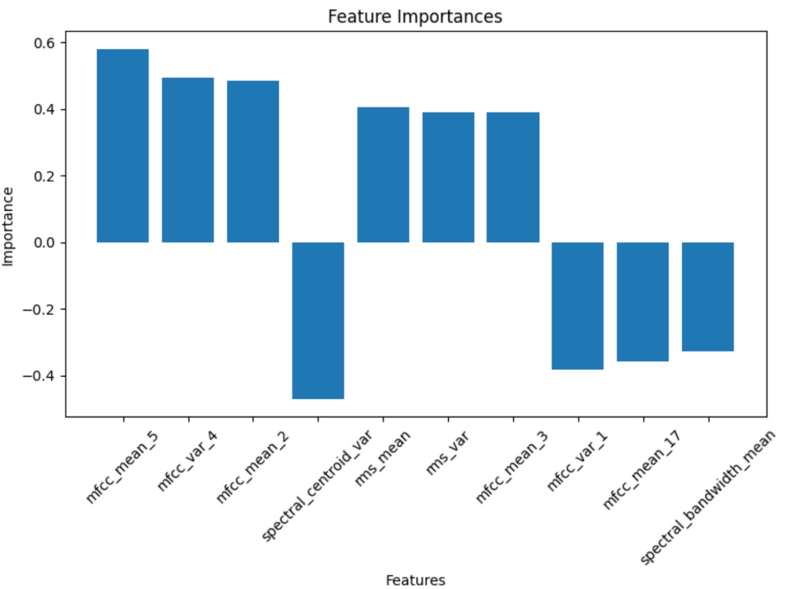
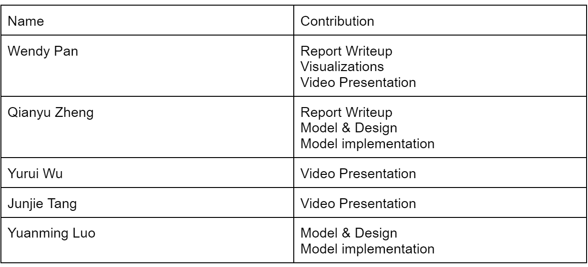

# Final Report

## Video Presentation
Here is the [video](https://youtu.be/cDLpC4zQck0?feature=shared). 
<em>In case some images are blurry, here is the [powerpoint](https://docs.google.com/presentation/d/1ZXGhcdAGeFXCk3ihe1iL1aWWWi3Pb9FFnTlNrgS7FUw/edit?usp=sharing).</em>

## Introduction/Background
The intersection of music and machine learning has been a vibrant area of research, with significant breakthroughs in both music classification and generation. In 2002, Tzanetakis proposed three feature sets specifically for genre classification [1], which laid the groundwork for following studies. Li further refined feature extraction by proposing Daubechies Wavelet Coefficient Histograms [2]. Method-wise, Lerch [3] proposed a hierarchical system, granting expansion capabilities and flexibility. Model-wise, both deep-learning and traditional machine-learning approaches are applied and examined [4].

Our dataset comprises 10 genres, each with 100 audio files of 30 seconds in length, accompanied by image visual representations for each file. It also includes two CSV files: one details mean and variance of multiple features extracted from each 30-second song, and the other provides similar data, but the songs were split before into 3 seconds audio files.

For our project, we will be testing with the 30 seconds data, but for training we will use different data for different strategies, as discussed below.

We are mostly interested in tempo, root mean square (RMS), spectral features such as centroid, bandwidth, and rolloff capture different aspects of the frequency content, zero crossing rate measures the noisiness, MFCCs related to the timbral texture of the sound, harmony, chroma that captures the intensity of the 12 different pitch classes, etc. These are the more significant features in DL and traditional ML learning [4].

Link to the [GTZAN dataset](https://www.kaggle.com/datasets/andradaolteanu/gtzan-dataset-music-genre-classification).

## Problem Definition
The primary issue addressed is the use of machine learning techniques to classify music into genres. The possibility of improving the existing music recommendation algorithms serves as its driving force. We can promote a deeper understanding of musical structures and music creation and give listeners a more engaging and personalized experience by appropriately classifying different genres of music. The issue is justified with economic concerns. When consumers are constantly presented with irrelevant suggestions, poor recommendation algorithms not only make the user experience worse but may also cause streaming platforms to incur financial losses. The project's goal is to strengthen the bond between listeners and music, which will benefit streaming services' bottom line as well as their audience's general contentment.

## Methods

### Strategy 1: Stacked MFCC & Chroma
#### Method
This idea was inspired by the notebook available on [kaggle](https://www.kaggle.com/code/eonuonga/gtzan-genre-classification-preprocessing-1-2).

In the data preprocessing phase, we extract a set of 12-channel Mel-Frequency Cepstral Coefficients (**MFCC**) and **Chroma** features, along with their first and second derivatives, from the raw audio signals. These features are commonly employed in music genre classification tasks due to their ability to effectively capture essential spectral and harmonic information present in the audio data. The complete data preprocessing workflow is shown in the following diagram:

The preprocessing pipeline ensures that the raw audio signals are transformed into a suitable format for further analysis and modeling.

Following the vectorization of each audio signal, we applied Principal Component Analysis (**PCA**) as a dimensionality reduction technique prior to fitting most of the models. Then, we proceeded to train various machine learning models on the preprocessed dataset. The model-fitting workflow for model fitting is depicted below:

#### Results
The models are evaluated with a **10-fold cross validation**.

The best-performing model is **Gaussian Naive Bayes**, with the confusion matrix on one fold of data as follows:

The confusion matrix shows that the model performs well in predicting certain genres like pop and classical as evidenced by the high counts along the diagonal in the test matrix. However, there is significant misclassification for some genres, particularly disco being frequently misclassified as pop and country being misclassified as blues, indicating areas where the model needs improvement.

#### Discussion and Reflection
For the sake of simplicity, we condense this section for strategy 1. A more detailed discussion on this strategy can be found in our [midterm report](./midterm_report.md).

This initial approach of using the entire MFCC and Chroma graphs as features for music genre classification yielded suboptimal results, with model performance around 60% despite hyperparameter tuning. We hypothesize that the high dimensionality introduced by considering the entire graphs leads to the curse of dimensionality, limiting the models' ability to learn and generalize effectively. To address this issue, we propose reducing the number of features by extracting key characteristics from the MFCC and Chroma graphs, such as statistical measures or domain-specific metrics, and incorporating additional graphs and features like spectrograms, tempo graphs, and root mean square (RMS) values. By carefully selecting and engineering features that capture essential information from the audio signals, we aim to improve the performance of the music genre classification models while striking a balance between representational power and model complexity, naturally transitioning to our second strategy.

### Strategy 2.1: Manual Feature Engineering
This innovative idea was the result of a group discussion.

Note: a more detailed description and reflection for this strategy can be found in our [midterm report](./midterm_report.md).

#### Method
For data preprocessing, we referenced the IEEE paper [4] and generated 77 features (eg. tempo, rms_mean, rms_var, etc.) for each 30-second audio. We extract the meaningful features to convert raw audio signals into feature vectors as their representations.

The **77 features** we used are:

Mean and variance of root-mean-square of frames, spectral centroid, spectral bandwidth, spectral rolloff, zero crossing rate, harmony, 20 MFCC and 12 Chromas, and tempo as a scalar.

Following feature generation, we fit different ML models to the generated tabular data.

#### Results
The models are evaluated with a 10-fold cross validation.

The best-performing model is **SVM** with OVO as the decision type and radial basis function as the kernel, with the confusion matrix on one fold of data as follows:

#### Discussion and Reflection
OVO SVM in this case presents the most well-performing result. This might be due to several factors. The audio data, when transformed into features like MFCCs, Chroma, etc., usually result in a high-dimensional space. Each dimension represents a particular characteristic of the sound. The SVM with RBF kernel excels in such environments as it does not get overwhelmed by the number of features and instead uses them to construct a hyperplane that can separate the genres with maximum margin. The RBF kernel is particularly adept at dealing with non-linearity. SVM is based on the concept of the distance between the separating hyperplane and the nearest points from both classes. Maximizing the margin tends to increase the model's robustness and its ability to generalize. The SVM's regularization parameter C also plays a pivotal role in controlling the trade-off between achieving a large margin and minimizing the classification error. This can prevent the model from overfitting.

Yet, it is important to acknowledge that manual feature selection can be a challenging and time-consuming process. It requires **domain expertise** and extensive experimentation to identify the most informative and discriminative features for music genre classification. Despite the improvement in accuracy, the current result of 74% still falls short of our desired goal of achieving a satisfactory model with a test accuracy exceeding 80%.

### Strategy 2.2: Manual Feature Engineering with Split Training
This innovative idea was contributed by Yuanming Luo.

#### Method
This strategy is a modification of the aforementioned strategy 2.1. It stems from a simple yet insightful intuition: **a segment of an audio is also an audio**. The modified ML pipeline is demonstrated in the image below:

During training, the original audio sample is split into k equal-sized subsamples. For each subsample, the same 77 features are computed and stored in a corresponding datapoint. The collection of these data points, which capture different portions of the original audio, are used to train a machine learning model such as an SVM, Random Forest, or MLP.

For inference on a new audio sample, the audio is similarly split into **k equal-sized subsamples**. Features are computed for each subsample to create k data points. These data points are passed into the trained ML model to get k corresponding predictions. Finally, the k predictions are **aggregated** in some fashion (e.g. majority vote) to produce a final prediction for the full original audio sample.

#### Results

We have tried to split each audio into k=10 and k=5, and found that k=10 worked better so here are the results for k=10. These are the accuracy and F1 plots after training on all models (SVM and OVO-SVM have exactly the same statistics). **MLP** performed the best with an accuracy of approximately 79.08%, closely followed by SVM with 78.98%. The worst performance was observed with GaussianNB. Similar to accuracy, SVM also excelled in terms of the F1 score with approximately 0.773, indicating a balanced performance between precision and recall. MLP also showed competitive performance with an F1 score of 0.7728. 

The best-performing models are SVM and MLP, with the confusion matrices on one fold of data as follows:

#### Discussion and Reflection
The method of splitting the audio into subsamples, computing features for each subsample, and aggregating predictions offers several advantages over simply training on features generated from the entire original audio:

1. Local feature extraction: By breaking the audio into smaller segments, the model can learn to recognize local patterns and characteristics that may be obscured or averaged out when considering the full audio at once. Training on subsample features allows the model to capture these local variations effectively.

2. Increased training data and reduced overfitting: Splitting the audio into subsamples effectively increases the amount of training data, as each subsample can be treated as a separate training example. For k = 10, this essentially expands the size of training data by 10x. Coming with a larger dataset reduces overfitting. The model learns to make predictions based on a variety of subsample features, rather than relying on the specific characteristics of the full audio samples in the training set. This promotes better generalization to unseen data.

3. Aggregation of predictions: The final aggregation step, where predictions from each subsample are combined, allows the model to make a more informed and robust prediction for the entire audio sample. By considering the outputs from different segments, the model can account for variations and inconsistencies within the audio and arrive at a consensus prediction. This aggregation step helps to smooth out potential errors and improve the overall classification accuracy.

4. One of our teammates, Yuanming Luo, who is a math major, provides a formal mathematical proof for explaining the improvement of our models' performance. The whole proof can be found in the appendix at the very bottom of the page.

However, this modification of strategy 2.1 doesn't promote our models' performance on the test set to above 80%. After discussion, we propose the following reasons:

1. Mismatch between subsample and full audio genres: when an audio sample is split into subsamples, there is no guarantee that each subsample will belong to the same genre as the full audio. For example, a country music audio may contain segments that resemble blues or other genres. This mismatch can introduce noise and confusion into the training process. The model may learn to associate certain subsample features with the wrong genre label, leading to suboptimal performance. In Luo's proof, he investigated how percentages of mislabeled data affects the upper-bound accuracy of the model.

2. Incorrect training labels: Since the subsamples are labeled based on the genre of the full audio, any mismatch between the subsample genre and the full audio genre results in incorrect training labels. The model is essentially being trained on noisy or misleading data, where the features of a subsample may not correspond to the assigned genre label. This can lead to suboptimal training results, as the model struggles to learn the correct associations between features and genres. The model may overfit to the noisy labels, reducing its ability to generalize well to new, unseen audio samples.

### Strategy 3: Two-step VGG Fine Tuning
The idea of leveraging CNN architecture was contributed by Qianyu Zheng.

#### Method
To fine-tune a **pre-trained VGG model** with TensorFlow for a new task, we followed these steps: 

(1) Use tensorflow built in data preprocessing method to preprocess the data so that the data format aligns with the images in ImageNet, on which VGG is pretrained, as follows:

(2) Replace the original output head of the VGG model with a custom 2-layer feedforward neural network tailored to our problem.

(3) Initially, freeze the weights of the convolutional layers and **only train the newly added output head**, allowing the model to adapt to the new task while leveraging the pre-trained features.

(4) After training the output head, unfreeze the **last convolutional block** of the VGG model, which consists of three convolutional layers and a pooling layer, and fine-tune these layers along with the output head. This allows the model to refine the high-level features specific to our task.

The model structure:

During step 3 and 4, we monitor the **validation accuracy** and apply **early stopping** to prevent overfitting. We select the model checkpoint with the highest validation accuracy as the final fine-tuned model. Fortunately, due to the robust tensorflow library, we went smoothly through the training process.

#### Results
With 10-fold cross validation, our model achieves average accuracy of 87.40% and average f1-score of 0.858. As an example for demonstration, the accuracy curve and the corresponding confusion matrix on the test data for fold 5 are shown below. To view accuracy curves and confusion matrices for all folds, you can refer to `code/notebooks/VGG_fine_tuning.ipynb`. It's worthy of noting that this is the first approach with which we achieve an average accuracy that is greater than 80% on test data.

#### Discussion and Reflection
The 2-step fine-tuning process, which involves first training the output head and then fine-tuning the last convolutional block, allows the model to effectively adapt to your specific task while leveraging the pre-trained features learned from the ImageNet dataset. By gradually unfreezing layers and fine-tuning them, the model can refine its representations and capture task-specific patterns, leading to improved performance.

Note that we train the last few convolution layers instead of the initial ones. Here is the justification for doing so:

The first few layers of a CNN that is pretrained on a diverse dataset normally learn low-level features like edges, contours, and simple patterns. These features are generally universal and transferable across different tasks and datasets. However, the later layers learn more high-level and task-specific features. These layers capture complex patterns and combine the low-level features to create representations that are more relevant to the specific task at hand. When fine-tuning for a new task, we want these later layers to adapt to features that are discriminative and informative for our target problem.

The accuracy curve and confusion matrix provided for fold 5 serve as a valuable demonstration of the model's performance. The accuracy curve illustrates how the model's accuracy evolves during the training process, providing insights into convergence and potential overfitting. The confusion matrix, on the other hand, offers a detailed breakdown of the model's predictions, highlighting the classes that the model performs well on and those that may require further attention. Overall, the 2-step fine-tuned VGG approach has shown impressive results and holds promise for your task. The combination of converting audios to images, transfer learning, gradual fine-tuning, and carefully designed preprocessing steps has proven to be an effective strategy.

### Comparing three strategies
#### Performance
Based on the rigorous 10-fold cross-validation results, which consider both the F1-score and accuracy metrics, it is evident that the fine-tuned VGG model (Strategy 3) outperforms the other approaches. The manual feature engineering approach (Strategy 2) follows closely in terms of performance, while the model in Strategy 1 exhibits the lowest performance among the three strategies. This ranking highlights the effectiveness of transfer learning and deep learning techniques in capturing complex patterns and achieving superior results compared to traditional machine learning models.

#### Computational Cost
The models in Strategy 1 and Strategy 2, which include traditional machine learning algorithms such as SVM and Logistic Regression, typically have a training time of less than 1 minute when executed on a regular CPU. This efficiency can be attributed to the relatively small input data size compared to deep learning approaches. However, XGBoost, an ensemble method used in Strategy 2, tends to have a longer training time due to its iterative nature and the computational overhead involved in calculating gradients repeatedly.

It's noteworthy that computing features in Strategy 2 is time-consuming. Generating 77 features for 999 * 10 audio segments took around 1.5 hours. This step is hard to optimize, as it is performed with the librosa library on CPU.

In contrast, Strategy 3, which involves fine-tuning a deep learning model (VGG), requires significantly more time and computational resources for training. To overcome this challenge and efficiently train the model, Qianyu, one of the team members, utilized his paid subscription to Google Colab. With access to an NVIDIA A100 GPU, the training time for each fold of data was reduced to approximately 50 seconds. This highlights the importance of leveraging specialized hardware and cloud computing resources to accelerate the training process of computationally intensive deep learning models.

#### Requirement for Domain-Specific Knowledge
Among the three strategies, strategy 2 requires the greatest amount of domain-specific knowledge, as it involves manual feature engineering and selection. Deciding what features to generate from raw audios can be a challenging task for researchers who don't have a solid understanding of signal processing, music theory, etc. We spent a great deal of time reading related literature to decide the 77 features involved in the strategy. Yet, our selection may be suboptimal, and it is likely that there exists a better combination of features for this task.

In comparison, Strategy 3 (VGG) requires the least amount of domain-specific knowledge and manual feature engineering, as the only manual data processing here is the generation of spectrograms from the audios. Tasks such as image preprocessing, feature extraction and combination are taken care of by the deep learning model.

#### Model interpretability
Among the three strategies, strategy 2 yields the most explainable solution. For example, with strategy 2.1, applying logistic regression yields the following top-10 important features map:

It's easy for us to analyze the results as follows:

The feature with the highest positive importance is mfcc_mean_5, followed by mfcc_var_4 and mfcc_mean_2. This indicates that these Mel-Frequency Cepstral Coefficient (MFCC) features, which capture timbral characteristics, are the most influential for the model in making correct classifications. On the other hand, the feature with the largest negative importance is spectral_bandwidth_mean. A high value for this feature seems to steer the model away from the correct class. The model may have learned that examples with high spectral_bandwidth_mean tend to belong to other classes.

In addition, eight of the top ten important features are related to MFCCs. (mfcc_mean_* and mfcc_var_*) This suggests that the timbral information captured by MFCCs is more discriminative for this audio classification problem.

However, for the best-performing strategy 3, such analysis becomes an impossible task, as feature extraction processes are encoded in the deep CNN layers. Thus, there comes the classical tradeoff between model performance and model interpretability.

### Summary of Techniques
#### Data Preprocessing
Strategy 1: MFCC & Chroma generation, PCA

Strategy 2: Manual feature engineering, data splitting

Strategy 3: Spectrogram generation, model-specific data processing (e.g., Cropping, Normalization, Channel flipping, etc.)

#### Quantitative Metrics & Visualizations
We mainly used accuracy and f1 score as the metrics for model benchmarking.

We visualize the results with barplots for model benchmarking, confusion matrices for classification results, feature importances for model evaluation, and accuracy curve for tracking VGG training process.

#### Algorithms & Models
Strategy 1: Logistic regression, SVM, Gaussian naive bayes, Random forest, PCA*

Strategy 2: Logistic regression, SVM, Gaussian naive bayes, Random forest, Multi-Layer Perceptron (MLP), eXtreme Gradient Boosting (XGBoost)

Strategy 3: Visual Geometry Group (VGG)

*For unsupervised learning methods

## Next Steps
Here are some potential next steps for this project:

Perform more systematic exploratory data analysis on the dataset generated for strategy 2.1 and 2.2, since proper feature selection is key to success for this strategy. Methods can include:
* Univariate Analysis: compute the mean and variance of each feature to detect potential outliers in the data.
* Bivariate Analysis: analyze the relationships between pairs of variables. For example, we can compute Variance Inflation Factor (VIF) between variables to detect potential multicollinearity between features which may harm the performance of certain models. Another example will be a heat map displaying correlation between all pairs of features.
* PCA: with the feature importance plot above, we observe that some features contribute a little to the model. PCA can potentially reduce the dimension and create more meaningful features for the task.

For strategy 2.2, cope with subsample label mismatches by assigning a feature that represents the deviation of a subsample with the complete audio. A straightforward approach will be computing the L2 norm of 77 features of the subsample with the 77 features of the whole sample, though more rigorous trials and mathematical formulations will be required to verify the usefulness of this approach.

Try other deep learning models like ResNet to further improve the results obtained by Strategy 3.

Use the MFCC images instead of spectrograms as training data for deep learning models, as their importance is proven in the feature importance plots shown above.

## References
[1]: Tzanetakis, G. and Cook, P. (2002) 'Musical genre classification of Audio Signals', IEEE Transactions on Speech and Audio Processing, 10(5), pp. 293-302. doi:10.1109/tsa.2002.800560.\
[2]:  Li, T., Ogihara, M., & Li, Q. (2003, July). A comparative study on content-based music genre classification. In Proceedings of the 26th annual international ACM SIGIR conference on Research and development in information retrieval (pp. 282-289).\
[3]: Burred, J. J., & Lerch, A. (2003, September). A hierarchical approach to automatic musical genre classification. In Proceedings of the 6th international conference on digital audio effects (pp. 8-11).\
[4]: Ndou, N., Ajoodha, R., & Jadhav, A. (2021, April). Music genre classification: A review of deep-learning and traditional machine-learning approaches. In 2021 IEEE International IOT, Electronics and Mechatronics Conference (pp. 1-6). IEEE\
[5] Bahuleyan, H. (2018). Music Genre Classification using Machine Learning Techniques. arXiv:1804.01149v1

## Contribution Table

## Gantt Chart
Here is the [Gantt Chart](https://gtvault-my.sharepoint.com/:x:/g/personal/ypan390_gatech_edu/EeUk8XSMMSFAqpbJ5cSKEDQBIkUN30qINQYGgmnCyVkJLg?e=4%3A6bQdYn&at=9&CID=8b4a2e17-0dca-5391-786c-d97bbece4005).

### Appendix
[Yuanming Luo's Proof](./CS4641ProjectIdeaAndTheory.pdf)

[back](./)
