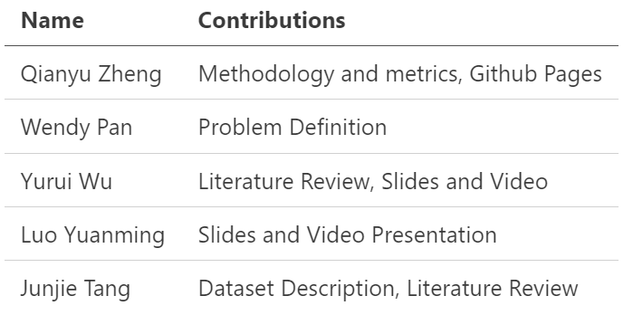

## Project Proposal

### Demo Video
Here is the link to our [demo video](https://youtu.be/bam3MmC0Zl4)!

### Introduction/Background

#### Literature Review
The intersection of music and machine learning has been a vibrant area of research, with significant breakthroughs in both music classification and generation. In 2002, Tzanetakis proposed three feature sets specifically for genre classification [1], which laid the groundwork for following studies. Li further refined feature extraction by proposing Daubechies Wavelet Coefficient Histograms [2]. Method-wise, Lerch [3] proposed a hierarchical system, granting expansion capabilities and flexibility. Model-wise, both deep-learning and traditional machine-learning approaches are applied and examined [4].

#### Dataset
We use **GTZAN** as our dataset of interest. It comprises 10 genres, each with 100 audio files of 30 seconds in length, accompanied by image visual representations for each file. It also includes a CSV file with details about mean and variance of multiple features extracted from each 30-second audios.

Here is the link to the [GTZAN dataset](https://www.kaggle.com/datasets/andradaolteanu/gtzan-dataset-music-genre-classification).

### Problem Definition
The main problem addressed is the classification of music into genres using machine learning techniques. By accurately classifying music genres, music companies like Spotify can better organize a user's music library by automatically tagging songs and effectively provide personal music recommendation. In addition, understanding nuances between genres allows creators to compose to target specific audiences and produce novel or hybrid genres.

### Methodology
To accomplish the aforementioned goals, the following will be applied:

#### Data processing
These preprocessing techniques will be performed on raw audios:
- Generate music-related features for audios with **librosa** library. E.g., the chromagram, Mel-frequency cepstral coefficients (MFCCs) and their first and second derivatives.
- Use **one-hot encoding** to encode the labels (genre of music).
- **Scale** the generated features with max-min or standardization.
- Select only first T frames from each audio as features.

#### ML Algorithms/Models
We provision a three-stage process for model development:
- Start with **traditional machine learning models** (with scikit-learn), including Logistic Regression, SVM, and ensemble methods.

- Performing **unsupervised learning** on the initial dataset (with scikit-learn). Tentative methods include dimensionality reduction or clustering analysis.

- Further leverage **deep learning models** (with tensorflow/pytorch). Methods include MLP, CNN, and RNN.

### Results and Discussion
#### Numerical Metrics
The followin metrics will be considered: (all the metrics will be calculated on the validation/test set)
- Loss: used when comparing different models.
- Accuracy: the most straightforward metric for all classification tasks. Suitable here as the dataset is balanced and unbiased.
- Confusion Matrix: a tabular representation of the classifier's performance that displays the number of TNs, TPs, FPs and FNs for each class.
- Precision-Recall and its derived metrics:
    - F1 score: a balance between precision and recall.
    - ROC curve and its AUC.

#### Project Goal
The goal of the project is described as follows:
- Establish baseline performance with simple ML models
- Experiment with various feature extraction or data augmentation techniques
- Leverage a combination of unsupervised and supervised models to improve the performance of models
- Evaluate and identify the optimal model.

#### Expected outcome
A classifier that performs well (based on metrics defined above) on classifying audios to their genres.

### References
[1]: Tzanetakis, G. and Cook, P. (2002) 'Musical genre classification of Audio Signals', IEEE Transactions on Speech and Audio Processing, 10(5), pp. 293-302. doi:10.1109/tsa.2002.800560.\
[2]:  Li, T., Ogihara, M., & Li, Q. (2003, July). A comparative study on content-based music genre classification. In Proceedings of the 26th annual international ACM SIGIR conference on Research and development in information retrieval (pp. 282-289).\
[3]: Burred, J. J., & Lerch, A. (2003, September). A hierarchical approach to automatic musical genre classification. In Proceedings of the 6th international conference on digital audio effects (pp. 8-11).\
[4]: Ndou, N., Ajoodha, R., & Jadhav, A. (2021, April). Music genre classification: A review of deep-learning and traditional machine-learning approaches. In 2021 IEEE International IOT, Electronics and Mechatronics Conference (pp. 1-6). IEEE

### Contribution Table

### Gantt Chart
Here is the [link](https://gtvault-my.sharepoint.com/:x:/g/personal/ypan390_gatech_edu/EeUk8XSMMSFAqpbJ5cSKEDQBIkUN30qINQYGgmnCyVkJLg?e=4%3A6bQdYn&at=9&CID=8b4a2e17-0dca-5391-786c-d97bbece4005) to the gantt chart.

[back](./)
